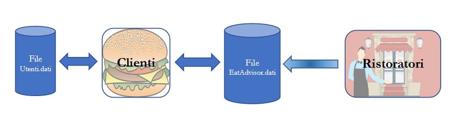

# EatAdvisor

A university project, build with Java 13, to manage restaurant reviews.

The project consists of two applications: 
- EatAdvisotRistoratori: with which restaurateurs will be able to manage their restaurants.
- EatAdvisorClienti: with which customers will be able to consult the restaurants within the platform and leave reviews.

