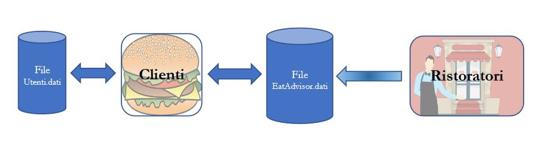

# EatAdvisor

A university project, build with Java 13, to manage restaurant reviews.

The project consists of two applications: 
- EatAdvisotRistoratori: with which restaurateurs will be able to manage their restaurants.
- EatAdvisorClienti: with which customers will be able to consult the restaurants within the platform and leave reviews.

## Colors
- Background: #f4f4f4
- Background secondary: #fff4c4
- Accent: #c71e23
- Border: #9b9b9b
- Stars: #ffca18
- Text primary: #000000
- Text secondary: #8f8f8f
- Font: Arial
