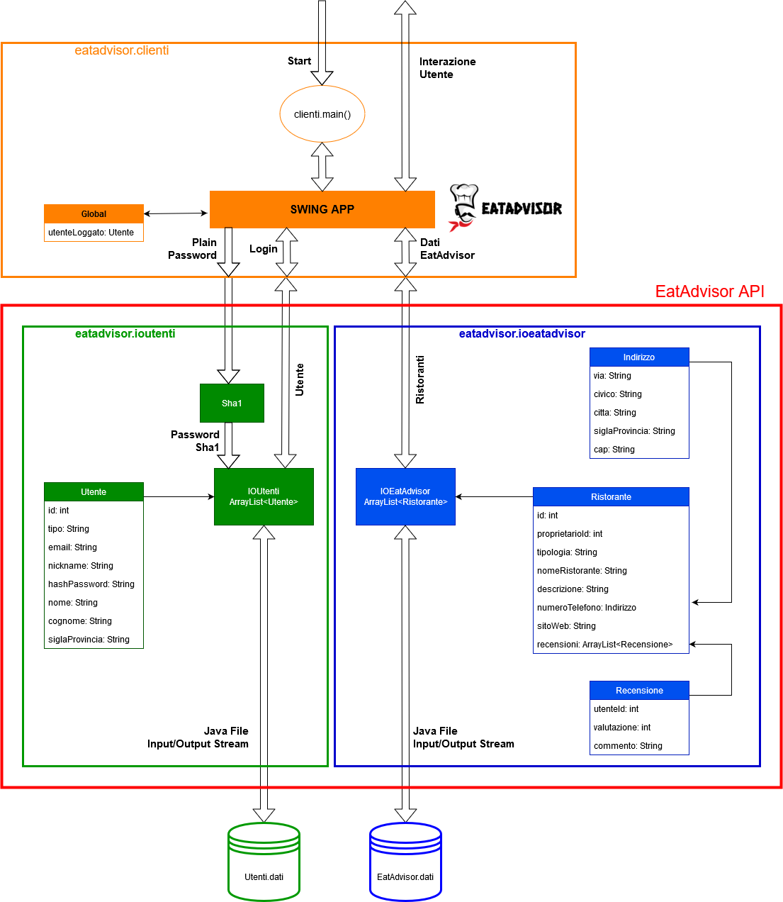
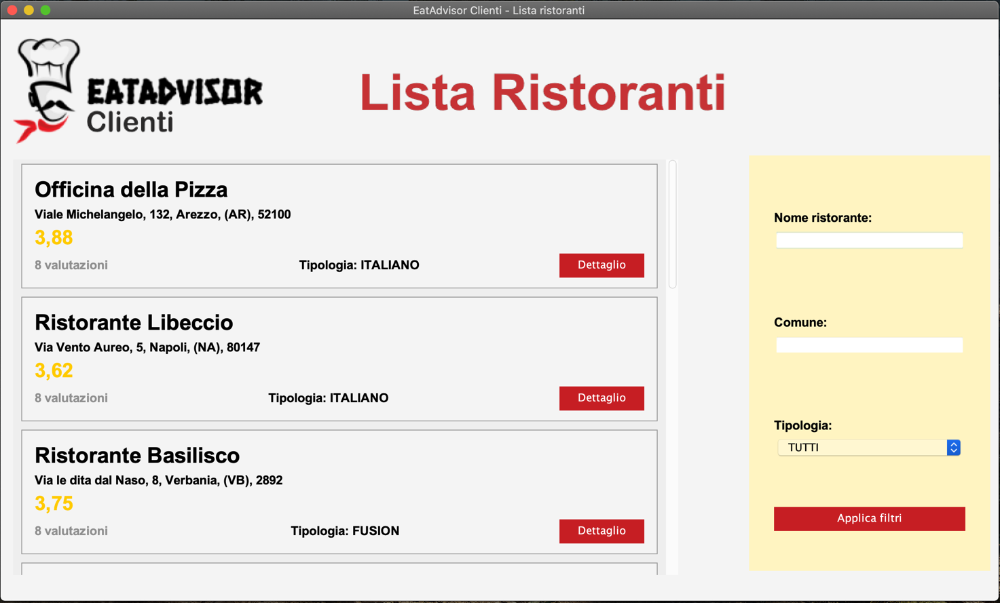
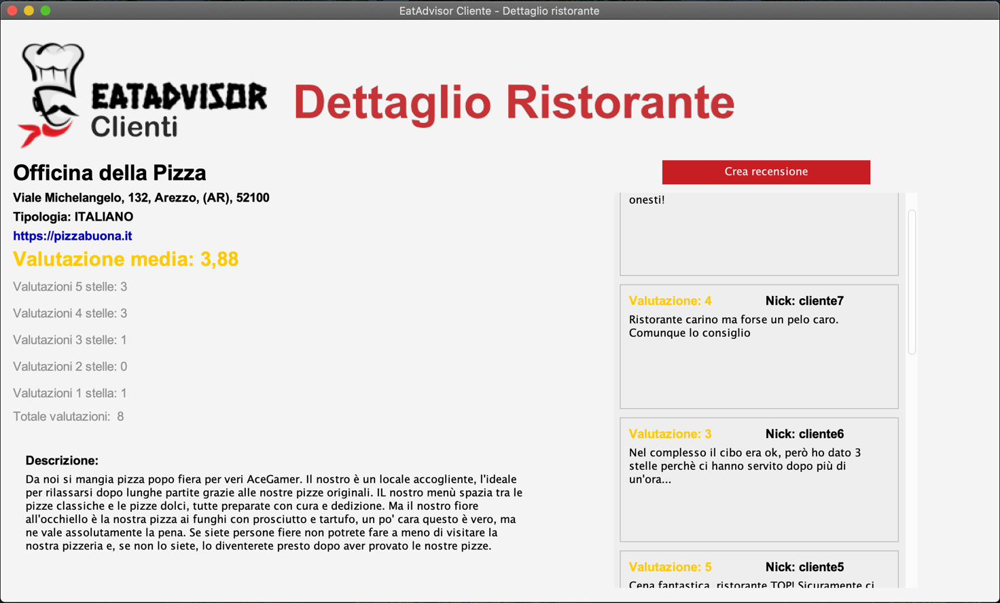

# EatAdvisor

A boring university project, build with Java 13, to manage restaurant reviews.

The goal of the EatAdvisor project is to create an evaluation system for restaurants based on the opinions 
expressed by customers. The ratings are expressed on a scale from 1 to 5 stars, where 5 stars represents 
the maximum score.
Together with the numerical judgment, each customer can also leave a textual comment of up to 256 characters.

All data are stored in two files:
- EatAdvisor.data: that contains all the information on restaurants, and the opinions expressed by customers
- Users.data: in which all the users registered on EatAdvisor are saved.

## Structure

## Some screen
#### EatAdvisor login

#### EatAdvisor restaurant list

#### EatAdvisor restaurant detail

